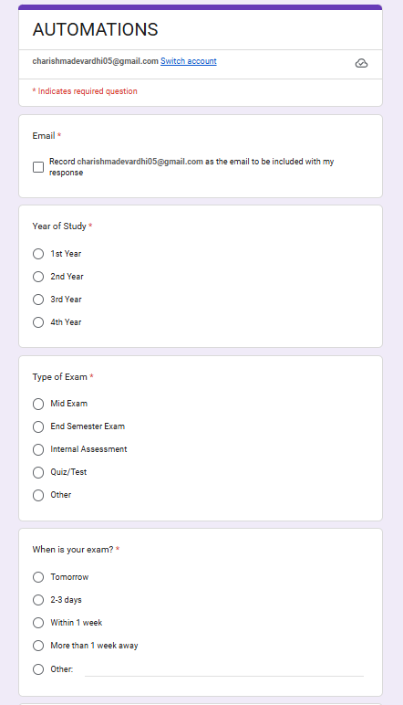
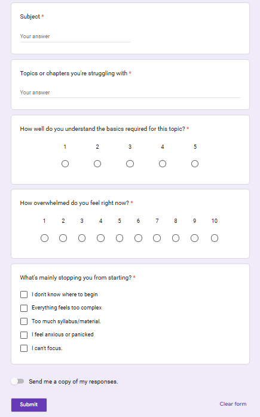
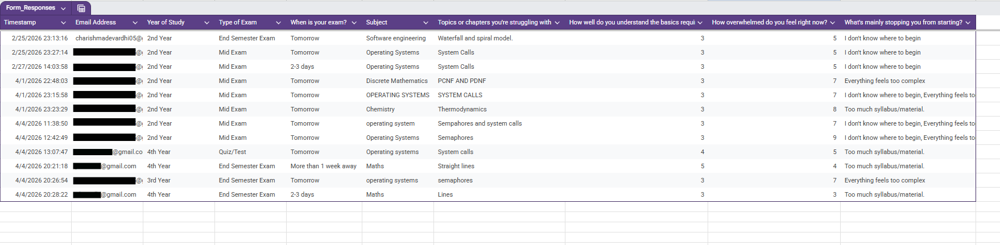
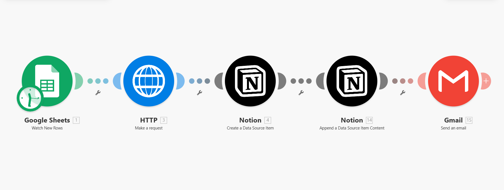
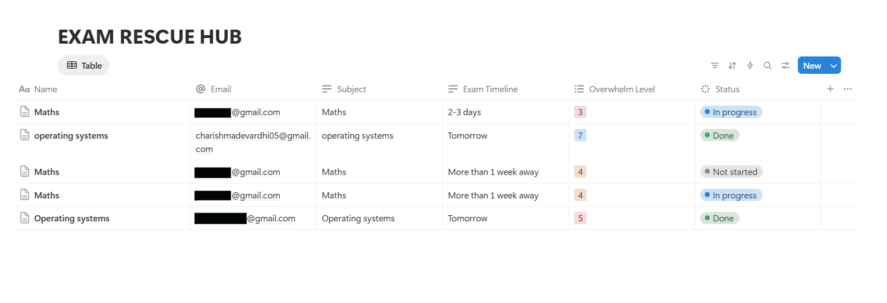
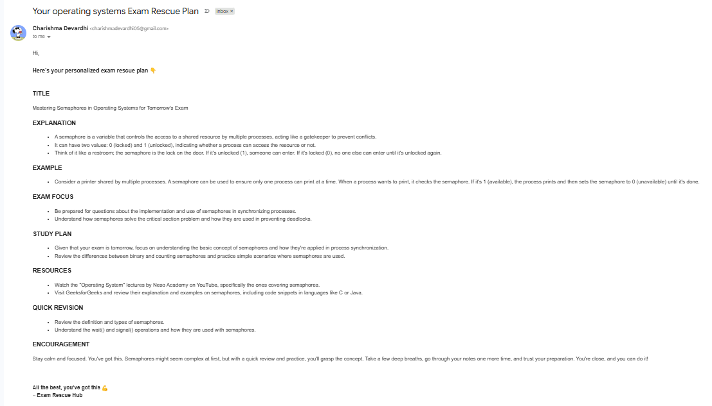

# 📚Exam-rescue-automation
AI-powered automation that helps students overcome exam stress by identifying key pain points 
through a form and delivering personalized explanations with real-life analogies, exam-focused 
insights, structured study plans, resources and quick revision tips automatically.
Designed to be a reliable guide when time is limited and pressure is high.

---
## 💭 The problem
Before exams, students often feel overwhelmed.
1. Too many topics, very less time.
2. Difficulty understanding certain concepts.
3. Unable to clearly articulate doubts.
4. Not sure what to focus on.
Even with AI tools available, stress makes it harder to think clearly.
---
## 🟢 What exam rescue automation solves.
This automation bridges the gap between confusion and clarity during exam preparation.
Instead of expecting students to figure out what to ask, it guides them through a structured form that captures exactly what they're struggling with.
Based on their responses, it delivers:
- Clear explanations using simple, real life analogies.
- Exam focused insights (what actually matters)
- A structured, time-based study plam
- Curated resources
- Quick revision plan
It acts like a calm, personal guide during high-pressure situations, helping students focus.
--- 
## 🧩 How it works
The automation is designed to be simple for the user, while handling all complexity in the background.
Here’s how it works:

1. The user fills out a short Google Form with details about their exam, topic, and difficulties  
2. The responses are captured instantly in Google Sheets  
3. The automation sends this data to an AI model via an HTTP request  
4. The AI generates a personalized explanation, study plan, and resources  
5. The generated content is stored and structured inside Notion (as a data source item)  
6. Additional formatted content is appended to the Notion page for better readability  
7. The final structured output is then sent to the user via email.
   
Everything happens automatically, requiring minimal effort from the user while ensuring organized storage and delivery of results.

---
## ⚙️Workflow breakdown
The automation follows a structured pipeline:
Google Form  
⬇️  
Google Sheets (captures responses)  
⬇️  
HTTP Request (sends user input to AI model)  
⬇️  
Notion (creates a structured data source item)  
⬇️  
Notion (appends formatted content to the page)  
⬇️  
Gmail (delivers the final output to the user)

Each step is connected through automation, ensuring a smooth flow from input to delivery without manual intervention.

---
## 💻 Tools & Technologies
- Make (Integromat) – Automation workflow engine 
- Google Forms – Captures student pain points
- Google Sheets – Acts as trigger layer for Make 
- HTTP Module – Connects the system to the AI model via API
- Groq API (LLaMA 3.3 70B)AI-generated explanations and study plans 
- Notion – Stores and structures generated content  
- Gmail – Delivers formatted, personalized results to the user
---
## 🚀 Key Features
- 🧠 Simplified explanations using real-life analogies  
- 🎯 Exam-focused insights (what to prioritize)  
- 📅 Personalized, time-based study plan  
- 📚 Curated resources for faster understanding  
- ⚡ Quick revision points for last-minute prep  
- 📩 Automated email delivery with structured output  
---
## 🧠 Process flow visual (Screenshots)
### 📥 User input (Google Forms) 

---

---
### 📊 Data Capture (Google Sheets)

---
### 🔄 Automation Workflow (Make)

---
### 🗂️ Structured Output Storage (Notion)

---
## 🚀 Output (Gmail)

---

## 📈 Future improvements

- 🧠 AI-powered memory aids such as mnemonics and visual explanations (including generated visuals)
- 🎮 Gamified learning experience with streak-based progression and evolving “learning trees”
- 🎯 Adaptive starting point based on the user’s current understanding level
- 🗺️ Intelligent learning roadmap generation for focused and time-efficient preparation
- 🔁 Active recall system that prompts questions after task completion (integrated with Notion tracking)
- 📊 Productivity-based personalization by analyzing user patterns (e.g., via tools like RescueTime)                  
- 🧘 Smart break recommendations based on user mood and stress signals (e.g., journaling inputs)
- 🔔 Automated reminders and nudges to maintain consistency and reduce procrastination
 
 ---
## 🔗 Explore the system
A full demo will be shared on LinkedIn.
This system is currently available on a limited basis.
📩 Feel free to reach out to me on LinkedIn if you'd like to try it.
- Linkedin : www.linkedin.com/in/jeriprolucharishmadevardhi

